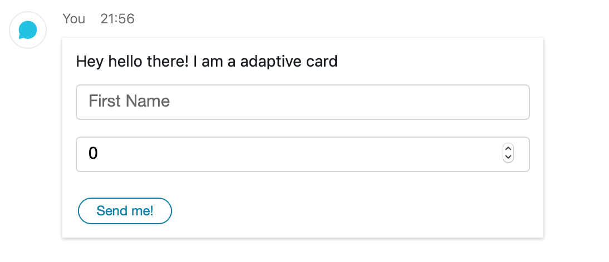

.. _Cards:

=================
Cards and Buttons
=================

Webex Teams supports `AdaptiveCards <https://www.adaptivecards.io/>`_ to allow
new levels of interactivity for bots and integrations. You can read more about
how cards and buttons work `in the official guide <https://developer.webex.com/docs/api/guides/cards>`_.

In this guide I want to cover the abstraction build into the webexteamssdk that
lets you author adaptive cards in pure python without having to touch the
underlying json of a adaptive card.

Lets dive into a simple example that sends a card to a room

.. code-block:: python

    from webexteamssdk import WebexTeamsAPI
    from webexteamssdk.cards.card import AdaptiveCard
    from webexteamssdk.cards.inputs import Text, Number
    from webexteamssdk.cards.components import TextBlock
    from webexteamssdk.cards.actions import Submit

    greeting = TextBlock("Hey hello there! I am a adaptive card")
    first_name = Text('first_name', placeholder="First Name")
    age = Number('age', placeholder="Age")

    submit = Submit(title="Send me!")

    card = AdaptiveCard(body=[greeting, first_name, age], actions=[submit])

    api = WebexTeamsAPI()
    api.messages.create(text="fallback", roomId="...", attachments=[card])

The message we send with this code then looks like this in our Webex Teams
client:

