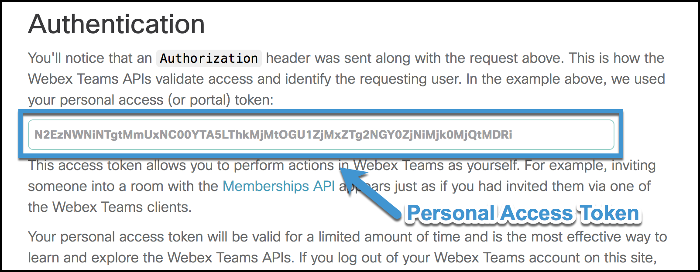

.. _Quickstart:

.. currentmodule:: webexpythonsdk

==========
Quickstart
==========

*Dive in!*  ...to get started using the webexpythonsdk package:

Make sure that you have:

* A Webex Account *(a free account works fine,* `sign-up for one here`__ *)*
* webexpythonsdk :ref:`installed <Install>`
* webexpythonsdk :ref:`upgraded to the latest version <Upgrade>`

__ Webex_

Get your Webex Access Token
---------------------------------

To interact with the Webex APIs, you must have a **Webex Access Token**.
A Webex Access Token is how the Webex APIs validate access and identify the
requesting user.

To get your personal access token:

    1. Login to `developer.webex.com`_
    2. Click on Docs or browse to the `Getting Started <https://developer.webex.com/docs/getting-started>`_ page
    3. You will find your *personal access token* in the
       `Authentication <https://developer.webex.com/docs/getting-started#accounts-and-authentication>`_ section

**Note:**

    "Your personal access token is great for testing the API with your account but it should never be used in
    applications."

Use your Webex Access Token
---------------------------------

As a `best practice`__, you can store your Webex access token 'credential' as
an environment variable in your development or production environment.  By
default, webexpythonsdk will look for a ``WEBEX_ACCESS_TOKEN`` environment
variable when creating new connection objects.

__ https://12factor.net/config

There are many places and diverse ways that you can set an environment
variable, which can include:

    * A setting within your development IDE
    * A setting in your container / PaaS service
    * A statement in a shell script that configures and launches your app

It can be as simple as setting it in your CLI before running your script...

.. code-block:: bash

    $ export WEBEX_ACCESS_TOKEN=your_access_token_here
    $ python myscript.py

...or putting your credentials in a shell script that you ``source`` when your
shell starts up or before your run a script:

.. code-block:: bash

    $ cat mycredentials.sh
    export WEBEX_ACCESS_TOKEN=your_access_token_here
    $ source mycredentials.sh
    $ python myscript.py

However you choose to set it, if you have your access token stored in a
``WEBEX_ACCESS_TOKEN`` environment variable when using webexpythonsdk, you are
good to go.  webexpythonsdk will pull and use this access token, by default,
when creating new :class:`WebexAPI` objects.

If you don't want to set your access token as an environment variable, or
perhaps your application will acquire access tokens via some other means, you
can manually provide your access token when creating a WebexAPI object.

Create a WebexAPI "Connection Object"
------------------------------------------

To make interacting with the Webex APIs as simple and intuitive as
possible, all of the APIs have 'wrapped' underneath a single interface.  To get
started, import the :class:`WebexAPI` class and create an API "connection
object".

.. code-block:: python

    >>> from webexpythonsdk import WebexAPI
    >>> api = WebexAPI()

As discussed above (`Use your Webex Access Token`_), webexpythonsdk defaults
to pulling your Webex access token from a ``WEBEX_ACCESS_TOKEN`` environment
variable.  If you do not have this environment variable set and you try to
create a new :class:`WebexAPI` object without providing a Webex access
token, a :exc:`webexpythonsdkException` will be raised.

.. code-block:: python

    >>> from webexpythonsdk import WebexAPI
    >>> api = WebexAPI()
    Traceback (most recent call last):
      File "<stdin>", line 1, in <module>
      File "webexpythonsdk/__init__.py", line 114, in __init__
        raise webexpythonsdkException(error_message)
    webexpythonsdkException: You must provide an Webex access token to interact
    with the Webex APIs, either via a WEBEX_ACCESS_TOKEN environment
    variable or via the access_token argument.

Use the ``access_token`` argument to manually provide your access token, when
creating a new :class:`WebexAPI` connection object.

.. code-block:: python

    >>> from webexpythonsdk import WebexAPI
    >>> api = WebexAPI(access_token='lkj345w...')

Note that this can be very useful if you are reading in access token(s) from a
file or database and/or when you want to create more than one connection
object.

.. code-block:: python

    >>> from webexpythonsdk import WebexAPI
    >>> chris_at = 'lkj345w...'
    >>> veronica_at = 'kl45kln...'
    >>> chris_api = WebexAPI(access_token=chris_at)
    >>> veronica_api = WebexAPI(access_token=veronica_at)

If you authenticate a user via a OAuth flow you can also initialize a api object
directly by providing the OAuth information.

.. code-block:: python

    >>> from webexpythonsdk import WebexAPI
    >>> client_id = "<from oauth>"
    >>> client_secret = "<from oauth>"
    >>> oauth_code = "<from oauth>"
    >>> redirect_uri = "<from oauth>"
    >>> api = WebexAPI(client_id=client_id,
                            client_secret=client_secret,
                            oauth_code=oauth_code,
                            redirect_uri=redirect_uri
                           )

You can also pass a proxy configuration upon initialization in case you are behind a firewall.  See the `requests
documentation on Proxies <https://2.python-requests.org/en/master/user/advanced/#proxies>`_ for details.

.. code-block:: python

    >>> from webexpythonsdk import WebexAPI
    >>> proxy = {'https': 'http://<proxy_ip>:<proxy_port>'}
    >>> api = WebexAPI(access_token=<your_access_token>, proxies=proxy)

Making API Calls
----------------

Now that you have created a :class:`WebexAPI` "connection object," you are
ready to start making API calls.

.. code-block:: python

    >>> api.people.me()
    Person({"displayName": "Chris Lunsford", "firstName": "Chris", "created": "2012-06-15T20:36:48.914Z", "lastName": "Lunsford", "emails": ["chrlunsf@cisco.com"], "avatar": "https://1efa7a94ed216783e352-c62266528714497a17239ececf39e9e2.ssl.cf1.rackcdn.com/V1~ba1ecf557a7e0b7cc3081998df965aad~7-HrvYOJSQ6eJgWJuFVbzg==~1600", "id": "Y2lzY29zcGFyazovL3VzL1BFT1BMRS9mZjhlZTZmYi1hZmVmLTRhNGQtOTJiMS1kNmIyMTZiNTg5NDk"})

It really is that easy.

All of the calls have been wrapped and represented as native Python method
calls, like :meth:`WebexAPI.people.me() <webexpythonsdk.api.people.PeopleAPI.me>` which gets the person details
for the authenticated user (the user who's access token you are using) - see
the `https://api.ciscospark.com/v1/people/me
<https://developer.webex.com/endpoint-people-me-get.html>`_ API endpoint
documentation.

As you can see, we have represented the API endpoints using simple terms
that are aligned with the API docs; for example, representing the ``people/me``
API endpoint as a ``people.me()`` method available underneath the
:class:`WebexAPI` connection object.

A full list of the available API methods, with their descriptions and
parameters, is available in the :ref:`User API Doc`, and a brief summary of the
structure is provided here.

.. include:: api_structure_table.rst

You can easily access and call any of these methods directly from your
:class:`WebexAPI` connection object:

.. code-block:: python

    >>> chris_id = "Y2lzY29zcGFyazovL3VzL1BFT1BMRS9mZjhlZTZmYi1hZmVmLTRhNGQtOTJiMS1kNmIyMTZiNTg5NDk"
    >>> api.people.get(personId=chris_id)
    Person({"displayName": "Chris Lunsford", "firstName": "Chris", "created": "2012-06-15T20:36:48.914Z", "lastName": "Lunsford", "emails": ["chrlunsf@cisco.com"], "avatar": "https://1efa7a94ed216783e352-c62266528714497a17239ececf39e9e2.ssl.cf1.rackcdn.com/V1~ba1ecf557a7e0b7cc3081998df965aad~7-HrvYOJSQ6eJgWJuFVbzg==~1600", "id": "Y2lzY29zcGFyazovL3VzL1BFT1BMRS9mZjhlZTZmYi1hZmVmLTRhNGQtOTJiMS1kNmIyMTZiNTg5NDk"})

Catching Exceptions
-------------------

If something should go wrong with the API call, an exception will be raised.
:exc:`ApiError` exceptions are raised when an error condition is
returned from the Webex cloud.  Details will be provided in the error
message.

.. code-block:: python

    >>> from webexpythonsdk import WebexAPI, ApiError
    >>> api = WebexAPI()
    >>> room = api.rooms.create("webexpythonsdk Test Room")
    >>> me = api.people.me()
    >>> api.memberships.create(roomId=room.id, personId=me.id)
    Traceback (most recent call last):
      File "<stdin>", line 1, in <module>
      File "webexpythonsdk/api/memberships.py", line 212, in create
        json_obj = self._session.post('memberships', json=post_data)
      File "webexpythonsdk/restsession.py", line 187, in post
        check_response_code(response, erc)
      File "webexpythonsdk/utils.py", line 104, in check_response_code
        response=response)
    webexpythonsdk.exceptions.ApiError: Response Code [409] - The request
    could not be processed because it conflicts with some established rule of
    the system. For example, a person may not be added to a room more than
    once.

You can catch any errors returned by the Webex cloud by catching
:exc:`ApiError` exceptions in a try-except block.

.. code-block:: python

    >>> try:
    ...     api.memberships.create(roomId=room.id, personId=me.id)
    ... except ApiError as e:
    ...     memberships = api.memberships.list(roomId=room.id)
    ...     for membership in memberships:
    ...         if membership.personId == me.id:
    ...             print("Doh!  I forgot that I am automatically added to a"
    ...                   "room when I create it.")
    ...             break
    ...     else:
    ...         print(e)
    ...
    Doh!  I forgot that I am automatically added to a room when I create it.
    >>>

webexpythonsdk will also raise a number of other standard errors
(:exc:`TypeError`, :exc:`ValueError`, etc.); however, these errors are usually
caused by incorrect use of the package or methods and should be sorted while
debugging your app.

Working with Returned Objects
-----------------------------

The Webex cloud returns data objects in JSON format, like so:

.. code-block:: json

    {
      "displayName": "Chris Lunsford",
      "firstName": "Chris",
      "created": "2012-06-15T20:36:48.914Z",
      "lastName": "Lunsford",
      "emails": [
        "chrlunsf@cisco.com"
      ],
      "avatar": "https://1efa7a94ed216783e352-c62266528714497a17239ececf39e9e2.ssl.cf1.rackcdn.com/V1~ba1ecf557a7e0b7cc3081998df965aad~7-HrvYOJSQ6eJgWJuFVbzg==~1600",
      "id": "Y2lzY29zcGFyazovL3VzL1BFT1BMRS9mZjhlZTZmYi1hZmVmLTRhNGQtOTJiMS1kNmIyMTZiNTg5NDk"
    }

Sure, JSON data objects can easily be parsed and represented in Python using
dictionaries, but when working with an 'object' wouldn't it be nice to be able
to work with it like an object - using native object syntax (like accessing
attributes using '.' notation)?  webexpythonsdk enables you to do just that:

.. code-block:: python

    >>> me = api.people.me()
    >>> me.id
    u'Y2lzY29zcGFyazovL3VzL1BFT1BMRS9mZjhlZTZmYi1hZmVmLTRhNGQtOTJiMS1kNmIyMTZiNTg5NDk'
    >>> me.displayName
    u'Chris Lunsford'

Representing and treating Webex data objects as Python data objects, can really
help clean up your code and make coding easier:

    1.  You don't need to create variables to hold the data attributes, just
        use the attributes available underneath the data object.

        .. code-block:: python

            >>> # Do this
            >>> api.people.get(personId=me.id)
            Person({"displayName": "Chris Lunsford", "firstName": "Chris", "created": "2012-06-15T20:36:48.914Z", "lastName": "Lunsford", "emails": ["chrlunsf@cisco.com"], "avatar": "https://1efa7a94ed216783e352-c62266528714497a17239ececf39e9e2.ssl.cf1.rackcdn.com/V1~ba1ecf557a7e0b7cc3081998df965aad~7-HrvYOJSQ6eJgWJuFVbzg==~1600", "id": "Y2lzY29zcGFyazovL3VzL1BFT1BMRS9mZjhlZTZmYi1hZmVmLTRhNGQtOTJiMS1kNmIyMTZiNTg5NDk"})
            >>> # Instead of this
            >>> my_id = me.id
            >>> api.people.get(personId=my_id)
            Person({"displayName": "Chris Lunsford", "firstName": "Chris", "created": "2012-06-15T20:36:48.914Z", "lastName": "Lunsford", "emails": ["chrlunsf@cisco.com"], "avatar": "https://1efa7a94ed216783e352-c62266528714497a17239ececf39e9e2.ssl.cf1.rackcdn.com/V1~ba1ecf557a7e0b7cc3081998df965aad~7-HrvYOJSQ6eJgWJuFVbzg==~1600", "id": "Y2lzY29zcGFyazovL3VzL1BFT1BMRS9mZjhlZTZmYi1hZmVmLTRhNGQtOTJiMS1kNmIyMTZiNTg5NDk"})

    2.  If your IDE supports auto-completion (like PyCharm_ for example), then
        you can easily see and 'tab-out' available attributes while coding.

        *For Example:* When working with a :class:`Person` object, your can
        type the object name followed by a dot '``me.``' and see a list of
        available attributes.  Typing a few more letters '``me.dis``' narrows
        down the attribute list to '``displayName``', and you can now simply
        hit '``<tab>``' to complete your attribute '``me.displayName``'.

        This speeds up coding and reduces typo coding errors.

    3.  When accessing 'optional' attributes, like the ``teamId`` attribute of
        a Webex Room object (only present when the room is part of a Webex
        Team), the :class:`webexpythonsdk.Room` object will return ``None`` when
        the attribute is not present and will return the attribute's value when
        it is present.  This avoids some boiler plate code and/or needless
        exception handling, when working with optional attributes.

        .. code-block:: python

            >>> # Instead of doing this
            >>> if hasattr(room, 'teamId'):
            ...     # Do something with the teamId attribute
            ...     pass
            >>> # Or this
            >>> try:
            ...     # Do something with the teamId attribute
            ...     room.teamId
            ... except AttributeError as e:
            ...     pass
            >>> # You can do this, which is cleaner
            >>> if room.teamId:
            ...     # Do something with the teamId attribute
            ...     pass

    4.  It just feels more *natural*.  :-)  When iterating through sequences,
        and working with objects in those sequences (see the next section),
        working with objects as objects is definitely more Pythonic.

        The Zen of Python (`PEP 20`_):
            "Beautiful is better than ugly."
            "Simple is better than complex."

A full list of the currently modeled :ref:`Webex Data Objects`, with their
attributes, is available :ref:`here <Webex Data Objects>` in the
:ref:`User API Doc`.

**What if Webex adds new data attributes?**

Attribute access WILL WORK for the newly added attributes (yes, without a
package update!), but tab-completion WILL NOT.  webexpythonsdk is written to
automatically take advantage of new attributes and data as they are returned;
however, tab-completion (which relies on source code and introspection) will
not work until we update the webexpythonsdk package (which is easy to do; raise
the issue on the issues_ page and bug us to add it).

Working with Returned 'Lists' of Objects
----------------------------------------

**Challenge**

When you ask Webex for a list of items (like all of the rooms that you are a
member of or all of the messages in a room), Webex needs to return these items
to you in an efficient way.  Sending all of the messages in a room in one
transaction or request isn't really feasible (imaging if the room had existed
for years!).  Additionally, what if you found what you were looking for in the
first few (most recent) messages?  Sending all of the items would have been a
waste of time and resources.

To facilitate efficient transactions when requesting lists of items, the Webex
APIs implement RFC5988 (Web Linking) to efficiently send 'pages' of responses
(see Pagination_ on the Webex for Developers site).  When you make a request to
an Webex API that leverages pagination, Webex returns the first 'page' of
results and a link to the 'next page' of results.  If information you need
isn't contained the first page, you can request the next and so forth.

**Solution**

Python has a similar construct as well - iterable_ objects.  Iterable objects
return their members one at a time, until they have all been returned.

webexpythonsdk marries these two concepts (pagination and iterables) to create a
simple interface for working with sequences of returned objects.

.. code-block:: python

    >>> # Returns a iterable object yielding all of the rooms you are a member of
    >>> rooms = api.rooms.list()

    >>> # Which can easily be iterated to find what you are looking for
    >>> for room in rooms:
    ...     if 'webexpythonsdk' in room.title:
    ...         demo_room = room
    ...         break

    >>> demo_room
    Room({"title": "webexpythonsdk Test Room", "created": "2016-11-12T03:24:39.278Z", "isLocked": false, "lastActivity": "2016-11-12T03:24:39.308Z", "creatorId": "Y2lzY29zcGFyazovL3VzL1BFT1BMRS9mZjhlZTZmYi1hZmVmLTRhNGQtOTJiMS1kNmIyMTZiNTg5NDk", "type": "group", "id": "Y2lzY29zcGFyazovL3VzL1JPT00vOGI1MTIwZTAtYTg4Ny0xMWU2LWFhZjUtZTlmYWEzMWQ1ZmRm"})

webexpythonsdk provides this functionality by returning
:class:`GeneratorContainer` objects for API calls that return lists of items.

In short, :class:`GeneratorContainer` s are iterable objects that incrementally
yield 'the next object' returned from your Webex API query request until all
items have been returned, and they are reusable.  If you create an ``rooms``
:class:`GeneratorContainer`, like we did above with
``rooms = api.rooms.list()``, you can use that object to iterate through the
rooms not just once but many times.

**Note:** Every time you iterate a :class:`GeneratorContainer` object, fresh
API calls are made so you are always working with 'live data' from the Cisco
Webex Cloud.

webexpythonsdk *automatically handles the pagination for you* so that you don't
have to think about it or write the boiler plate code to handle requesting
pages of responses.  webexpythonsdk automatically and efficiently requests
additional pages from Webex as needed to yield the items you have requested.

A :class:`GeneratorContainer` records all of the parameters of your API call,
and uses them to request data from Webex each time you iterate the container.

.. code-block:: python

    >>> # Returns a iterable object representing all of group rooms you are a member of
    >>> group_rooms = api.rooms.list(type='group')

    >>> # Returns a iterable object representing all of direct rooms you are a member of
    >>> direct_rooms = api.rooms.list(type='direct')

    >>> # Iterate through your group rooms
    >>> for room in group_rooms:
    ...     pass

    >>> # Iterate through your direct rooms
    >>> for room in direct_rooms:
    ...     pass

    >>> # You can iterate through your group rooms again;
    >>> # if a new room has been created since the last time, it will show up.
    >>> for room in group_rooms:
    ...     pass

**These iterable objects are great, but what if I really DO want a list?**

Sometimes you really DO want a ``list`` of items.  Perhaps you want to work
with the same static ``list`` of items to ensure you are looking at 'all of the
items' and to make sure that your list doesn't change while you are working
with it...

Whatever your reason for doing so, you can easily 'convert' an iterable
object to a standard Python ``list`` with the ``list()`` function.  This may
take a little time for all of the API calls to be made, but the list will
contain all of the returned objects.

.. code-block:: python

    >>> rooms_iterable = api.rooms.list()
    >>> rooms_list = list(rooms_iterable)

Extending the API with bound methods
------------------------------------

As the Webex API is developed and features are added, it may be necessary to extend the webexpythonsdk to access those features.
Extending the API is simple by binding your own methods to the WebexAPI connection object. By binding a method, you can
extend functionality and leverage all of the objects and quality of life features of webexpythonsdk.

.. code-block:: python

    >>> new_method(self, param):
        ...     json_obj = self._session.get('/example/action/' + param)
        ...     return json_obj

    >>> api = WebexAPI()
    >>> api.new_method = new_method
    >>> output = WebexAPI.new_method(param)

*Copyright (c) 2016-2024 Cisco and/or its affiliates.*

.. _Webex: https://www.webex.com/products/teams/index.html
.. _developer.webex.com: https://developer.webex.com/
.. _PyCharm: https://www.jetbrains.com/pycharm/
.. _PEP 20: https://www.python.org/dev/peps/pep-0020/
.. _issues: https://github.com/WebexCommunity/WebexPythonSDK/issues
.. _Pagination: https://developer.webex.com/pagination.html
.. _iterable: https://docs.python.org/2/glossary.html#term-iterable
